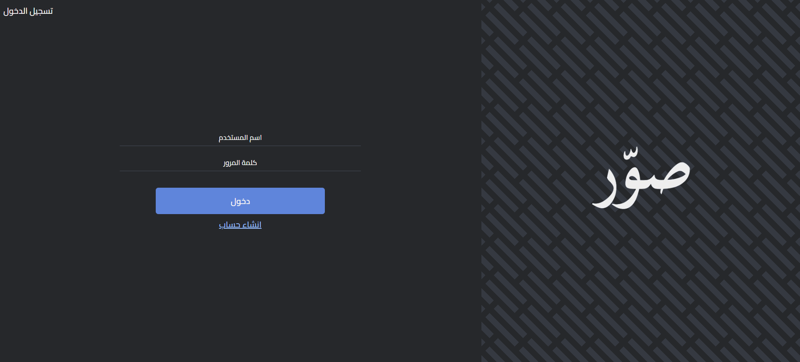
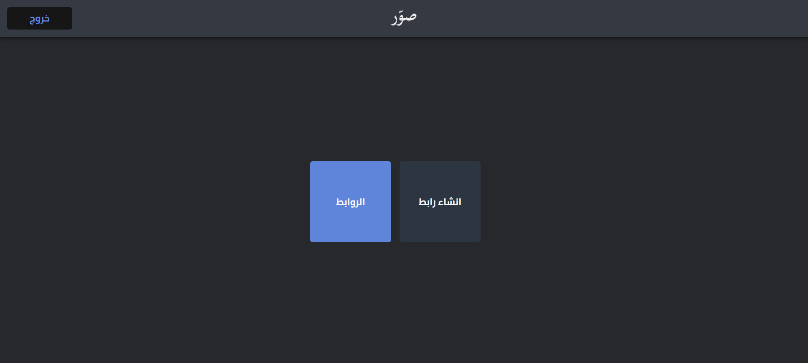
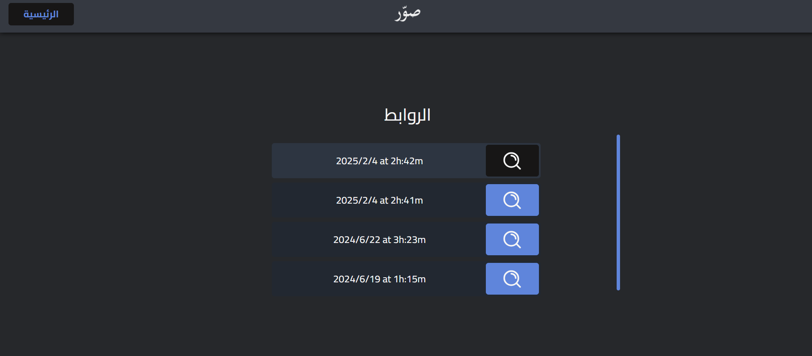
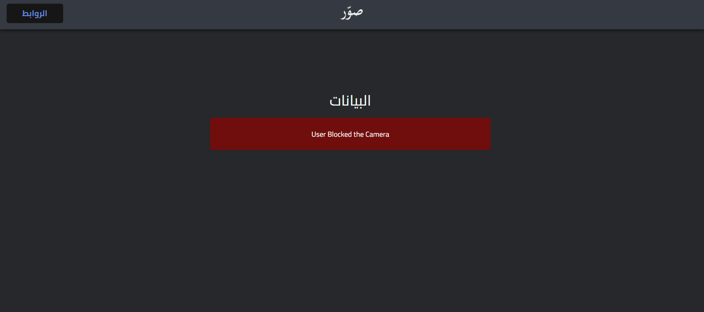

# sawer
Sawer System The Sawer System is a fun and innovative tool that allows you to create custom URLs. When someone visits one of these URLs, the system automatically captures an image using their device's camera and sends it to your specified tracking URL. You can then view and track the data associated with each unique URL you've created.

## Login Page


## Main Page


## Links Page


## Tracking Data Page



### To run the code you have to setup the database and run the server.js file.
##### sawer_database.sql
##### server.js

```bash
npm run dev
```